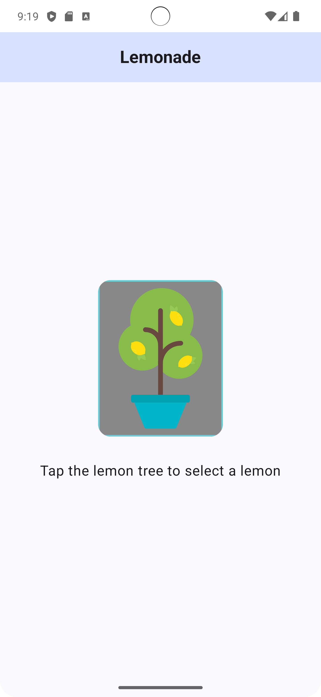
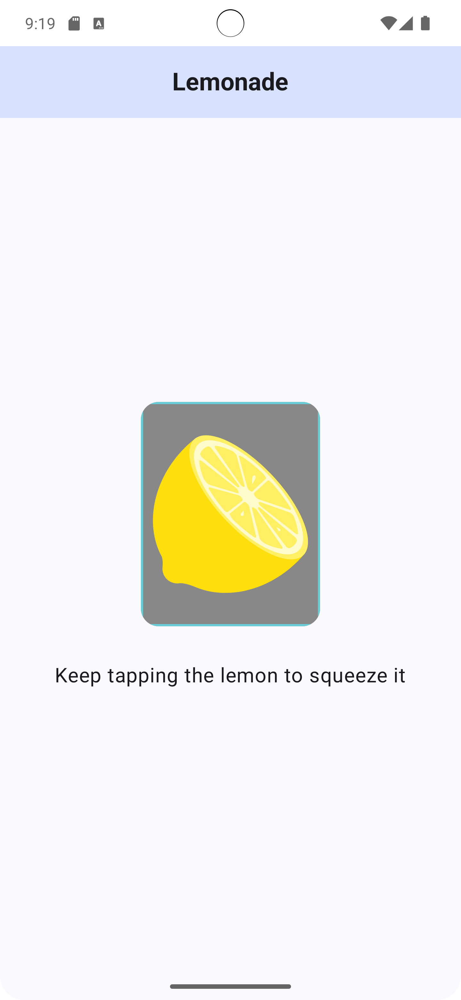
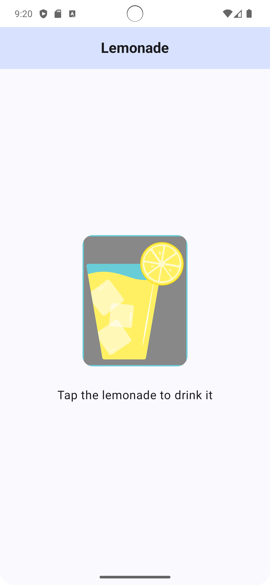
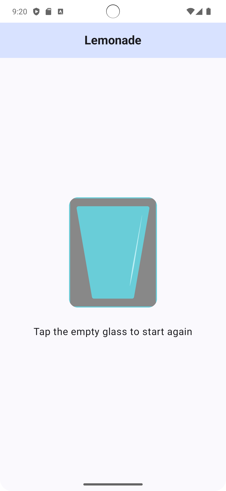

# 🍋 Lemonade App

This is a **Lemonade-making simulation app** built using **Jetpack Compose**, developed as part of learning exercises in **Android Basics with Compose**.

---

## 📜 Overview
The Lemonade App lets users **tap through stages of making lemonade**, from picking a lemon to squeezing it and drinking the final result. It demonstrates key principles in **Jetpack Compose UI**, **state management**, and **click behavior**.

---

## 🚀 Features
- 🌳 Tap the **lemon tree** to pick a lemon.
- 🍋 Tap the **lemon** multiple times to squeeze juice.
- 🍹 Get **fresh lemonade** after enough squeezes.
- 🔄 Restart the process after drinking.
- 📱 Fully **declarative UI** using Jetpack Compose.
- 🎨 Implements **Material Design** theming.
- 🖼️ **Dynamic image updates** based on the app stage.

---

## 🛠️ Tech Stack
- **Kotlin** 🧑‍💻
- **Jetpack Compose** 💡
- **State Management (`remember`, `mutableStateOf`)** ⚡
- **Android Studio** 🏗️

---

## 📷 App Screenshots

---
